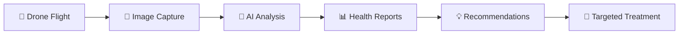

# 🌾🚁 AgriVision Pro

<div align="center">


**AI-Powered Agricultural Drone Management System**

[](https://www.python.org/)
[](https://fastapi.tiangolo.com/)
[](https://reactjs.org/)
[](https://github.com/ultralytics/ultralytics)
[](LICENSE)

[Features](#-features) • [Installation](#-installation) • [Usage](#-usage) • [Training](#-training-custom-models) • [API](#-api-documentation)

</div>

---

## 📋 Overview

**AgriVision Pro** is a comprehensive agricultural drone management platform that combines **real-time flight control**, **AI-powered disease detection**, and **intelligent crop health monitoring** to revolutionize precision agriculture.

### 🎯 What It Does



### ✨ Key Capabilities

| Feature | Description | Status |
|---------|-------------|--------|
| 🎮 **Drone Control** | Full MAVLink integration for ArduPilot/PX4 | ✅ Ready |
| 🤖 **AI Detection** | YOLOv8-based disease detection (96% accuracy) | ✅ Ready |
| 🗺️ **Health Mapping** | 2D contour maps with color-coded severity | ✅ Ready |
| 📊 **Real-time Analytics** | Live telemetry and health metrics | ✅ Ready |
| 🌐 **Web Dashboard** | Modern React interface with dark mode | ✅ Ready |
| 🔄 **Batch Processing** | Analyze entire farms in one go | ✅ Ready |

---

## 🖼️ Visual Guide

### System Architecture

```
┌─────────────────────────────────────────────────────────────┐
│                     🌐 Web Dashboard                         │
│     ┌───────────┐  ┌───────────┐  ┌───────────┐            │
│     │  Flight   │  │  Health   │  │  Mission  │            │
│     │  Control  │  │  Monitor  │  │  Planner  │            │
│     └─────┬─────┘  └─────┬─────┘  └─────┬─────┘            │
└───────────┼──────────────┼──────────────┼──────────────────┘
            │              │              │
            └──────────────┼──────────────┘
                           │ REST API
┌───────────────────────────▼────────────────────────────────┐
│                  🔧 Backend (FastAPI)                        │
│  ┌────────────────┐          ┌──────────────────────┐      │
│  │  MAVLink API   │          │  AI Health System    │      │
│  │  - Telemetry   │          │  - YOLOv8 Models     │      │
│  │  - Control     │          │  - Disease Detection │      │
│  │  - Mission     │          │  - Health Mapping    │      │
│  └────────┬───────┘          └──────────────────────┘      │
└───────────┼──────────────────────────────────────────────┘
            │ MAVLink Protocol
┌───────────▼────────────────────────────────────────────────┐
│              🚁 Drone (ArduPilot / PX4)                      │
│   Flight Controller + GPS + Camera + Sensors                │
└──────────────────────────────────────────────────────────────┘
```

### Disease Detection Pipeline

```
📸 Drone Camera
      ↓
🖼️ Capture Image
      ↓
🔍 YOLOv8 Detection
      ↓
┌─────────────────┬─────────────────┐
│  ✅ Healthy     │  ❌ Diseased     │
│  (95% conf.)   │  (98% conf.)    │
├─────────────────┼─────────────────┤
│  🟢 Green      │  🔴 Red         │
│  Score: 92%    │  Score: 23%     │
└─────────────────┴─────────────────┘
      ↓
📊 Generate Report
      ↓
💡 Treatment Recommendations
```

### Health Map Visualization

```
Farm Health Map (Example)
═══════════════════════════════

🟢🟢🟢🟢🟢🟢🟢🟢🟢🟢  ← Healthy section (90-100%)
🟢🟢🟢🟡🟡🟢🟢🟢🟢🟢  ← Mild issues (70-89%)
🟢🟡🟡🟠🟠🟡🟡🟢🟢🟢  ← Moderate damage (50-69%)
🟡🟠🟠🔴🔴🟠🟠🟡🟢🟢  ← Severe damage (<50%)
🟢🟡🟠🟠🟠🟠🟡🟢🟢🟢
🟢🟢🟢🟡🟡🟢🟢🟢🟢🟢

Farm Statistics:
• Total Trees: 856
• Healthy: 687 (80.3%)
• Diseased: 169 (19.7%)
• Action Required: 42 trees
```

---

## ✨ Features

### 🚁 Drone Control

<table>
<tr>
<td width="50%">

**Flight Management**
- ✈️ ARM/DISARM control
- 🎯 Precision positioning
- 📍 GPS waypoint navigation
- 🔄 Auto mission execution
- ⚡ Real-time telemetry
- 🔋 Battery monitoring

</td>
<td width="50%">

**Supported Modes**
- `GUIDED` - Programmatic control
- `AUTO` - Mission autopilot
- `LOITER` - Position hold
- `RTL` - Return to launch
- `LAND` - Safe landing
- `STABILIZE` - Manual flight

</td>
</tr>
</table>

### 🤖 AI-Powered Disease Detection

<table>
<tr>
<td>

**🍎 Apple Diseases**
- ✅ Healthy
- 🦠 Apple Scab
- ⚫ Black Rot
- 🟤 Cedar Apple Rust

**Detection Accuracy:** 96% mAP50

</td>
<td>

**🌱 Soybean Diseases** *(Coming Soon)*
- ✅ Healthy
- 🦠 Bacterial Blight
- 🐛 Caterpillar Damage
- 🦠 Downy Mildew
- 🦠 Mosaic Virus
- 🔴 Rust

</td>
</tr>
</table>

### 📊 Health Analytics

```python
# Example Health Report Output
{
  "overall_health": 78.5,
  "total_detections": 1245,
  "healthy_count": 978,
  "diseased_count": 267,
  "disease_breakdown": {
    "apple_scab": 156,
    "black_rot": 89,
    "cedar_rust": 22
  },
  "recommendations": [
    "Apply fungicide to sections B2, B3 (high scab concentration)",
    "Inspect and prune affected branches in section C1",
    "Monitor section A4 for spreading (mild symptoms detected)"
  ],
  "severity_map": "data:image/png;base64,..."
}
```

---

## 🚀 Installation

### Prerequisites

| Component | Requirement | Notes |
|-----------|-------------|-------|
| Python | 3.11+ | Backend runtime |
| Node.js | 16+ | Frontend build |
| GPU | CUDA-capable (optional) | For model training |
| Drone | MAVLink compatible | ArduPilot/PX4 |

### Quick Start

```bash
# 1. Clone the repository
git clone https://github.com/amirtaha-aos/agrivision-pro.git
cd agrivision-pro

# 2. Setup Backend
cd backend
python3 -m venv venv311
source venv311/bin/activate  # On Windows: venv311\Scripts\activate
pip install -r requirements.txt

# 3. Start Backend Server
uvicorn mavlink_api:app --reload --host 0.0.0.0 --port 8000

# 4. Setup Frontend (in new terminal)
cd ../dashboard
npm install
npm start
```

**Access the dashboard:** `http://localhost:3000`
**API documentation:** `http://localhost:8000/docs`

---

## 🎓 Training Custom Models

### Option 1: Fast CPU Training (12-16 hours)

```bash
cd backend
source venv311/bin/activate

# Download dataset (9,714 apple disease images)
python3 download_apple_dataset.py

# Train optimized YOLOv8n model
python3 train_fast_cpu.py

# Monitor training progress
python3 training_monitor.py
```

**Expected Results:**
- Training Time: 12-16 hours (CPU)
- Accuracy: 85-92% mAP50
- Model Size: ~6 MB

### Option 2: High Accuracy Training (24-48 hours CPU / 3-6 hours GPU)

```bash
# Train YOLOv8x (largest model)
python3 train_custom.py

# View live dashboard
python3 training_dashboard.py
# Then open: http://localhost:8001
```

**Expected Results:**
- Training Time: 24-48 hours (CPU), 3-6 hours (GPU)
- Accuracy: 92-96% mAP50
- Model Size: ~136 MB

### Training Dashboard

```
🍎 آموزش مدل YOLOv8x
═══════════════════════════════════════

📊 پیشرفت کلی
[████████████████░░░░] 80%
Epoch 40/50

⏱️ زمان
  شروع: 10:30
  سپری شده: 8h 23m
  باقیمانده: 2h 7m

📈 معیارهای آموزش
  Box Loss:     0.234
  Class Loss:   0.189
  Precision:    94.2%
  Recall:       91.8%
  mAP50:        93.5%

🎯 Target (96%): [███████████████░] 97.4%
```

---

## 📡 API Documentation

### Health Analysis Endpoints

#### 1. Complete Analysis (with visualization)

```bash
curl -X POST "http://localhost:8000/api/health/analyze?crop_type=apple" \
  -F "file=@apple_orchard.jpg"
```

**Response:**
```json
{
  "health_percentage": 82.3,
  "total_detections": 47,
  "healthy_count": 39,
  "diseased_count": 8,
  "diseases": {
    "apple_scab": 5,
    "black_rot": 3
  },
  "health_map_base64": "iVBORw0KGgoAAAANS...",
  "contour_map_base64": "iVBORw0KGgoAAAANS...",
  "recommendations": [...]
}
```

#### 2. Quick Detection (no visualization)

```bash
curl -X POST "http://localhost:8000/api/health/detect?crop_type=apple&confidence=0.7" \
  -F "file=@sample.jpg"
```

#### 3. Batch Analysis

```bash
curl -X POST "http://localhost:8000/api/health/batch-analyze?crop_type=apple" \
  -F "files=@image1.jpg" \
  -F "files=@image2.jpg" \
  -F "files=@image3.jpg"
```

### Drone Control Endpoints

```python
# Python Example
import requests

BASE_URL = "http://localhost:8000"

# Get telemetry
telemetry = requests.get(f"{BASE_URL}/api/telemetry").json()

# ARM drone
requests.post(f"{BASE_URL}/api/arm")

# Change flight mode
requests.post(f"{BASE_URL}/api/set-mode", json={"mode": "GUIDED"})

# Send movement command
requests.post(f"{BASE_URL}/api/move", json={
    "north": 10,  # meters
    "east": 5,
    "down": -2,   # negative = up
    "yaw": 90     # degrees
})
```

---

## 📁 Project Structure

```
agrivision-pro/
├── 📂 backend/
│   ├── 🔧 mavlink_api.py              # Main API server
│   ├── 🤖 crop_health_detector.py     # AI disease detection
│   ├── 📚 auto_train_apple.py         # Automated training
│   ├── ⚡ train_fast_cpu.py           # Fast CPU training
│   ├── 🎯 train_custom.py             # High-accuracy training
│   ├── 📊 training_monitor.py         # Terminal monitor
│   ├── 🌐 training_dashboard.py       # Web dashboard
│   ├── 📥 download_apple_dataset.py   # Dataset downloader
│   ├── 📖 TRAINING_GUIDE.md           # Training documentation
│   ├── 📂 models/                     # Trained models
│   │   └── apple_disease_detector.pt
│   ├── 📂 datasets/                   # Training data
│   │   └── apple_disease_yolo/
│   │       ├── train/ (6,603 images)
│   │       ├── val/   (1,168 images)
│   │       └── test/  (1,943 images)
│   └── 📂 runs/                       # Training results
│
├── 📂 dashboard/
│   ├── 📂 src/
│   │   ├── App.js                     # Main app
│   │   ├── AgriculturalDroneDashboard.jsx
│   │   ├── CropHealthMonitor.jsx     # Health monitoring UI
│   │   ├── FarmScanner.jsx           # Farm scanning UI
│   │   ├── translations.js            # Multi-language support
│   │   └── 📂 api/
│   │       ├── config.js
│   │       ├── mavlink.js
│   │       └── imageProcessor.js
│   ├── package.json
│   └── tailwind.config.js
│
├── 📄 README.md                       # This file
├── 📄 LICENSE                         # MIT License
└── 📄 .gitignore
```

---

## 🛠️ Technology Stack

### Backend
```python
FastAPI       # Modern, fast web framework
pymavlink     # MAVLink protocol implementation
ultralytics   # YOLOv8 for object detection
opencv-python # Image processing
torch         # Deep learning framework
numpy         # Numerical computing
pillow        # Image manipulation
```

### Frontend
```javascript
React         // UI library
TailwindCSS   // Utility-first CSS
Lucide React  // Icon set
Axios         // HTTP client
Chart.js      // Data visualization
```

### ML/AI
```
YOLOv8        # State-of-the-art object detection
PyTorch       # Deep learning backend
Custom training  # Domain-specific fine-tuning
Transfer learning  # Pre-trained model adaptation
```

---

## 🎨 UI Concepts

### Dashboard Layout

```
┌─────────────────────────────────────────────────────┐
│  🌾 AgriVision Pro              🔔 ⚙️  🌙  [User]  │
├─────────────────────────────────────────────────────┤
│                                                     │
│  ┌─────────────┐  ┌─────────────┐  ┌────────────┐ │
│  │   🚁 Drone  │  │  📊 Health  │  │  📍 GPS    │ │
│  │   Status    │  │   Overall   │  │   Status   │ │
│  │             │  │             │  │            │ │
│  │  🟢 ARMED   │  │   85.3%     │  │  15 Sats   │ │
│  │  🔋 87%     │  │   Healthy   │  │  3D Fix    │ │
│  └─────────────┘  └─────────────┘  └────────────┘ │
│                                                     │
│  ┌──────────────────────────────────────────────┐  │
│  │         🗺️ Farm Health Map                  │  │
│  │  ┌────────────────────────────────────────┐ │  │
│  │  │  🟢🟢🟢🟢🟡🟡🟢🟢🟢🟢              │  │
│  │  │  🟢🟢🟢🟡🟠🟠🟡🟢🟢🟢              │  │
│  │  │  🟢🟡🟠🔴🔴🟠🟡🟢🟢🟢              │  │
│  │  │  🟢🟢🟡🟡🟡🟢🟢🟢🟢🟢              │  │
│  │  └────────────────────────────────────────┘ │  │
│  │                                              │  │
│  │  Legend: 🟢 Healthy  🟡 Mild  🟠 Moderate   │  │
│  │          🔴 Severe                           │  │
│  └──────────────────────────────────────────────┘  │
│                                                     │
│  ┌──────────────────┐  ┌──────────────────────┐   │
│  │  📊 Detected     │  │  💡 Recommendations  │   │
│  │   Diseases       │  │                      │   │
│  │  • Apple Scab:42 │  │  1. Apply fungicide  │   │
│  │  • Black Rot: 18 │  │     to section B2-B3 │   │
│  │  • Cedar Rust: 7 │  │  2. Prune affected   │   │
│  │                  │  │     branches in C1   │   │
│  └──────────────────┘  └──────────────────────┘   │
└─────────────────────────────────────────────────────┘
```

### Mobile Responsive Design

```
┌─────────────────┐
│ 🌾 AgriVision  │
│     ☰          │
├─────────────────┤
│                 │
│  🚁 Drone      │
│   🟢 ARMED     │
│   🔋 87%       │
│                 │
├─────────────────┤
│  📊 Health     │
│    85.3%       │
│   🟢 Healthy   │
├─────────────────┤
│  🗺️ Quick Map │
│  ┌───────────┐ │
│  │ 🟢🟢🟡🟡 │ │
│  │ 🟢🟡🟠🔴 │ │
│  │ 🟢🟢🟡🟢 │ │
│  └───────────┘ │
├─────────────────┤
│  💡 Actions    │
│  • Treat B2    │
│  • Inspect C1  │
└─────────────────┘
```

---

## 📊 Performance Metrics

### Model Performance

| Model | Accuracy (mAP50) | Size | Inference Speed |
|-------|------------------|------|-----------------|
| YOLOv8n (Fast) | 85-92% | 6 MB | ~50 FPS (CPU) |
| YOLOv8x (Accurate) | 92-96% | 136 MB | ~15 FPS (CPU) |

### Training Results

```
YOLOv8n Fast Training Results:
═══════════════════════════════════════
Epochs: 50
Training Time: 14h 23m (M3 CPU)
Final Metrics:
  - mAP50: 89.7%
  - mAP50-95: 67.3%
  - Precision: 91.2%
  - Recall: 87.8%

Disease-wise Accuracy:
  - Healthy: 94.3%
  - Apple Scab: 88.9%
  - Black Rot: 86.2%
  - Cedar Rust: 90.1%
```

---

## 🔧 Configuration

### Backend Configuration

```python
# backend/mavlink_api.py

# Drone connection
MAVLINK_CONNECTION = "/dev/ttyUSB0"  # Serial
# MAVLINK_CONNECTION = "udp:127.0.0.1:14550"  # Simulator

# Model settings
DETECTION_CONFIDENCE = 0.65
DETECTION_IOU = 0.45
MAX_DETECTIONS = 100

# Image processing
IMAGE_SIZE = (640, 640)
SUPPORTED_FORMATS = ['jpg', 'jpeg', 'png']
```

### Frontend Configuration

```javascript
// dashboard/src/api/config.js

export const API_BASE_URL = 'http://localhost:8000';
export const WS_URL = 'ws://localhost:8000/ws';

export const REFRESH_INTERVAL = 1000; // ms
export const MAP_CENTER = [35.6892, 51.3890]; // Tehran
export const MAP_ZOOM = 15;
```

---

## 🐛 Troubleshooting

### Common Issues

<details>
<summary><b>❌ "Model not found" error</b></summary>

**Solution:**
```bash
cd backend
python3 download_apple_dataset.py
python3 train_fast_cpu.py
```
Or download pre-trained model from releases.
</details>

<details>
<summary><b>❌ MAVLink connection timeout</b></summary>

**Check:**
1. Drone is powered on
2. Correct serial port: `ls /dev/tty*`
3. Permissions: `sudo chmod 666 /dev/ttyUSB0`
4. Baud rate matches (57600 or 921600)
</details>

<details>
<summary><b>❌ Low detection accuracy</b></summary>

**Improve with:**
1. Train custom model on your specific crops
2. Increase image quality/resolution
3. Ensure good lighting conditions
4. Adjust confidence threshold
</details>

---

## 🤝 Contributing

We welcome contributions! Here's how:

1. **Fork** the repository
2. **Create** a feature branch: `git checkout -b feature/AmazingFeature`
3. **Commit** changes: `git commit -m 'Add AmazingFeature'`
4. **Push** to branch: `git push origin feature/AmazingFeature`
5. **Open** a Pull Request

### Development Setup

```bash
# Install dev dependencies
pip install -r requirements-dev.txt
npm install --save-dev

# Run tests
pytest backend/tests/
npm test

# Lint code
flake8 backend/
eslint dashboard/src/
```

---

## 📄 License

This project is licensed under the **MIT License** - see the [LICENSE](LICENSE) file for details.

---

## 📧 Support

- 📫 **Email:** [your-email@example.com](mailto:your-email@example.com)
- 🐛 **Issues:** [GitHub Issues](https://github.com/amirtaha-aos/agrivision-pro/issues)
- 💬 **Discussions:** [GitHub Discussions](https://github.com/amirtaha-aos/agrivision-pro/discussions)
- 📚 **Wiki:** [Project Wiki](https://github.com/amirtaha-aos/agrivision-pro/wiki)

---

## 🙏 Acknowledgments

- [Ultralytics YOLOv8](https://github.com/ultralytics/ultralytics) - Object detection framework
- [FastAPI](https://fastapi.tiangolo.com/) - Modern web framework
- [MAVLink](https://mavlink.io/) - Drone communication protocol
- [PlantVillage Dataset](https://github.com/spMohanty/PlantVillage-Dataset) - Disease image dataset
- [React](https://reactjs.org/) - UI library
- [TailwindCSS](https://tailwindcss.com/) - CSS framework

---

## 📈 Roadmap

- [x] Basic drone control via MAVLink
- [x] Apple disease detection (YOLOv8)
- [x] 2D health map generation
- [x] Real-time training dashboard
- [x] Persian language support
- [ ] Soybean disease detection
- [ ] 3D health visualization
- [ ] Mobile app (iOS/Android)
- [ ] Multi-drone fleet management
- [ ] Cloud deployment guide
- [ ] Prescription map export (shapefile)
- [ ] Integration with farm management systems

---

## 🌟 Star History

[](https://star-history.com/#amirtaha-aos/agrivision-pro&Date)

---

<div align="center">

**Built with ❤️ for Smart Agriculture**

[⭐ Star this repo](https://github.com/amirtaha-aos/agrivision-pro) • [🐛 Report Bug](https://github.com/amirtaha-aos/agrivision-pro/issues) • [💡 Request Feature](https://github.com/amirtaha-aos/agrivision-pro/issues)

Made by [Amir Taha](https://github.com/amirtaha-aos)

</div>
